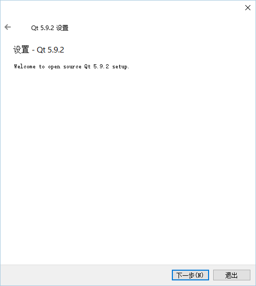

# Qt安装过程
## 1. 下载Qt安装程序
> 1. 直接从[官网](https://www.qt.io/)下载，需要先注册用户
> 1. 从[中国科学技术大学开源镜像站](http://mirrors.ustc.edu.cn/)下载安装程序[qt-opensource-windows-x86-5.9.2.exe](http://mirrors.ustc.edu.cn/qtproject/official_releases/qt/5.9/5.9.2/qt-opensource-windows-x86-5.9.2.exe)

## 2. 安装过程
> 1. 双击安装程序，启动安装, 如果系统有提示，请允许执行文件；
> 1. 在弹出的“Qt 5.9.2设置”窗口中，点击按键"Next"，继续；    
>        
> 1. 如果你不想在Qt官网中注册用户，直接点击弹出窗口中下方的“Next”按键，进入下一步，    
> 如果你是从官网下载的安装程序，可以在这个窗口中输入你的登录信息，再点击“Next”键钮进入下一步，    
> 当然也可以输入注册信息（这会使你成为Qt的官网用户）后，点击“Next”按键进入下一步；    
>    
> 1. 直接点击弹出窗口下方的“Next”按钮，跳过欢迎窗口；    
>    
> 1. 在弹出的安装文件夹设置窗口中，输入或通过浏览确认Qt安装的目标文件夹，    
> 当然，你也可以直接采用安装程序推荐的文件夹（不修改标记为1的文本框中的内容），    
> 如果你希望总是用Qt打开C/C++程序的源文件，请确认勾选标记为2的复选框（有勾），否则，请取消选中（无勾），    
> 然后，点击“Next”按钮，进入下一步；    
>        
> 1. 确认安装的组件    
> 点击窗口    
>     
> 左侧树形列表框中的符号‘>’，展开列表内容，窗口改变为    
> ，    
> 请确认选中红色标记中的所有组件，    
> 然后，点击“Next”按钮进入下一步；
> 1. 同意许可协议，并进入下一步；    
> 
> 1. 在窗口的文本输入框中输入Qt在开始菜单中显示的快捷方式名称，    
> 或直接采用默认的名称，继续安装过程；    
> 
> 1. 安装准备工作已完成，请点击窗口下方的“安装”按钮，开始安装程序文件；    
>    
> 1. 开始安装，窗口中的进度条会显示安装进程完成的工作量，    
> 在这个过程中，你可以点击“显示详细信息”按钮来查看安装的文件序列；    
>    
> 1. 当显示安装完成信息后，点击“下一步”继续；    
>    
> 1. 完成安装，    
> 如果你想现在就启动Qt开始尝试编写程序，请选中“Launch Qt Creator”前面的复选框，否则，请取消选择，    
> 点击“完成”按钮，结束安装程序。    
>    

## 3. 中文支持（设置文件编码为 GB2312 或 GB18030）
> 1. 启动Qt；
> 1. 执行菜单项：工具->选项，打开Qt设置窗口；    
>    
> 1. 在弹出窗口左边的列表框中，左键单击“文本编辑器”条目，然后，再在选择右边的“行为”标签页，即可看到与文件编码有关的设置。文件编码的默认设置通常会是“UTF-8”。    
>    
> 1. 点击默认编码右侧的下拉选择框，从列表中选择“GB2312”或“GB18030”，然后点击窗口下方的“OK”按钮，完成设置并退出Qt设备窗口。
>    
> 1. 新建项目后，就可以使用printf函数输出中文了。     
>    __备注：__ 设置之前保存的文件的文件编码并不会发生变化。如果，那些文件中已经有中文字符，可以在编辑窗口中，全选和拷贝文件内容后，关闭并删除文件；然后，新建一个C++源文件（注意后缀名应为“.c”），并把前面拷贝的文件内容再粘贴进去即可。

# 恭喜，Qt已经安装成功
### ......你可以开始尽情享受漫长的、“痛并快乐着”的程序员生涯了......
